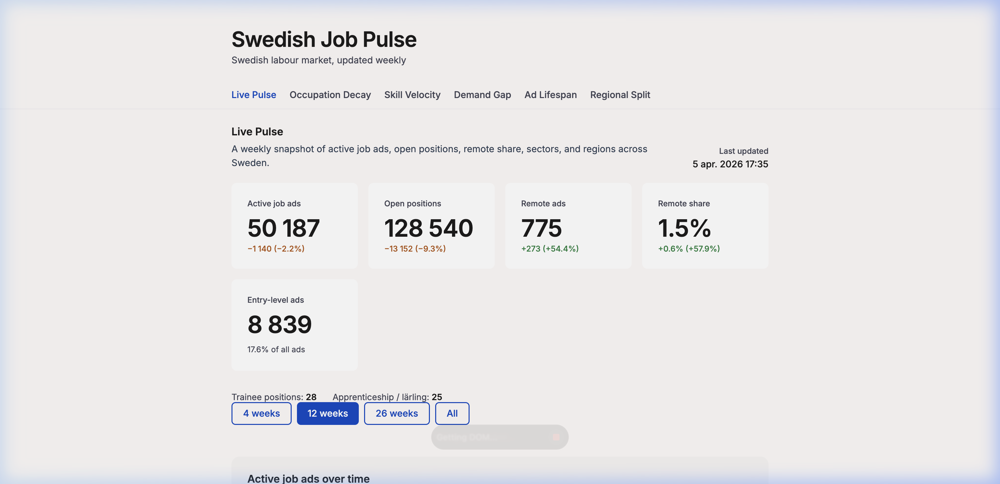
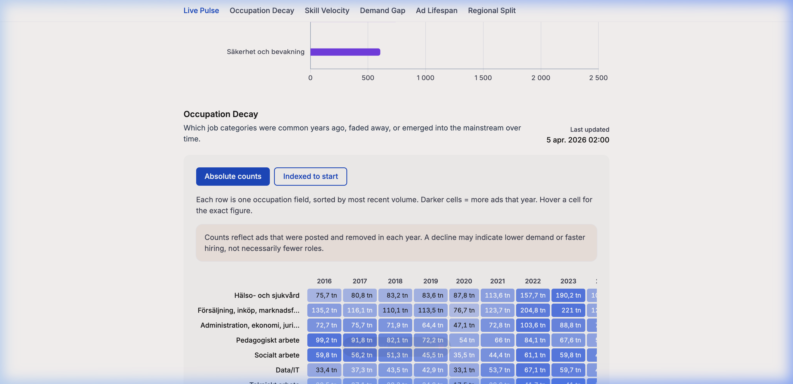
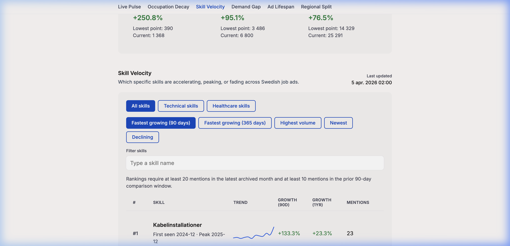
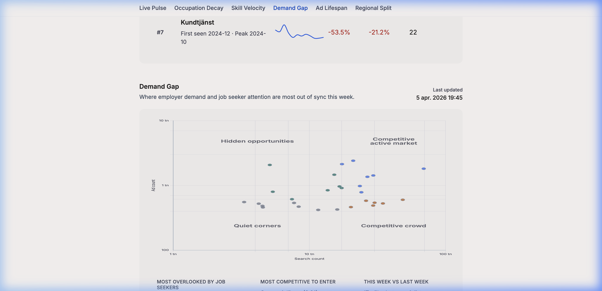
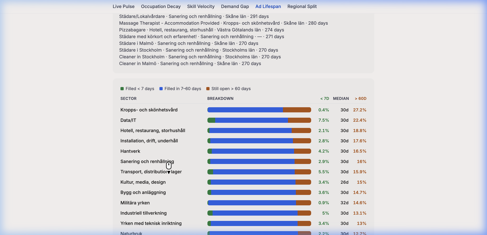
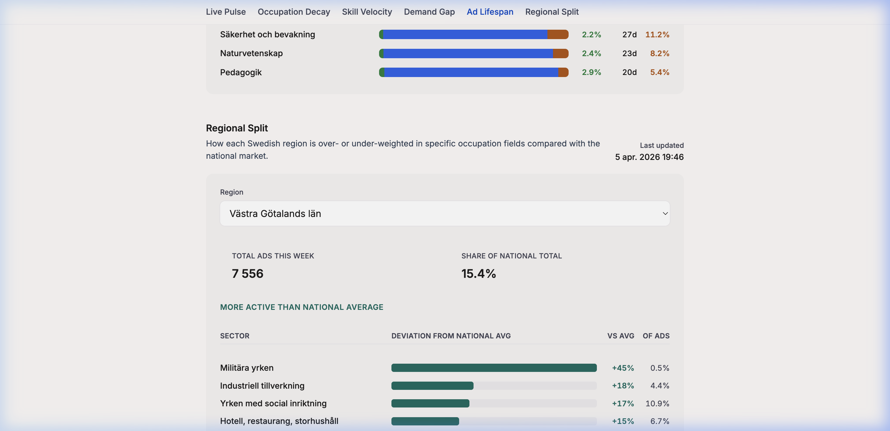

# Swedish Job Pulse

Swedish Job Pulse is a static labour-market dashboard built on top of public Arbetsförmedlingen JobTech data.

There is:

- no backend
- no database
- no framework
- no authentication

The app is the root frontend at [`index.html`](./index.html), styled by [`style.css`](./style.css), powered by [`app.js`](./app.js), and fed by static JSON files in [`data/`](./data).

## What The Dashboard Includes

The current dashboard is a single long page with these sections:

1. **Live Pulse**
   
2. **Occupation Decay**
   
3. **Skill Velocity**
   
4. **Demand Gap**
   
5. **Ad Lifespan**
   
6. **Regional Split**
   

The earlier Market Explorer section has been removed. Arbetsförmedlingen already provides a strong native browsing experience for live ads in Platsbanken, so the project now focuses on higher-signal static analysis instead.

## What The Top Numbers Mean

This distinction matters for almost every chart:

- `total_ads` = number of active ad records at the moment the weekly snapshot was collected
- `total_positions` = total vacancies across those ads
- `remote_ads` = active ads that match JobTech's `remote=true` filter
- `entry_level_ads` = active ads that match `experience=false`
- `week` = ISO week of collection, for example `2026-W14`

So:

- `50,187 ads` does not mean `50,187 ads were published that week`
- it means `50,187 ads were active when the snapshot was taken`

And:

- `128,540 open positions` can be much higher than `50,187 active ads`
- because one ad can recruit multiple people

## Repo Overview

Important runtime files:

```text
.
├── .github/workflows/update.yml
├── index.html
├── style.css
├── app.js
├── data/
│   ├── live.json
│   ├── history.json
│   ├── meta.json
│   ├── occupation_decay.json
│   ├── skill_velocity.json
│   ├── demand_gap.json
│   ├── ad_lifespan.json
│   └── regional_split.json
├── scripts/
│   ├── collect.py
│   ├── backfill.py
│   ├── process_decay.py
│   ├── process_skill_velocity.py
│   ├── process_demand_gap.py
│   ├── process_ad_lifespan.py
│   └── process_regional_split.py
├── requirements.txt
└── README.md
```

## Data Files

### Core weekly files

- [`data/live.json`](./data/live.json)
  Current snapshot only.
- [`data/history.json`](./data/history.json)
  Weekly snapshots, oldest first.
- [`data/meta.json`](./data/meta.json)
  Freshness metadata and tracked date range.

Current `live.json` fields:

- `week`
- `date`
- `total_ads`
- `total_positions`
- `remote_ads`
- `remote_by_field`
- `entry_level_ads`
- `entry_by_field`
- `trainee_ads`
- `larling_ads`
- `by_occupation_field`
- `by_occupation_group`
- `by_region`
- `by_municipality`

### Expanded section files

- [`data/occupation_decay.json`](./data/occupation_decay.json)
  Long-range yearly occupation-field counts.
- [`data/skill_velocity.json`](./data/skill_velocity.json)
  Monthly skill mention trends plus technical/healthcare skill subsets.
- [`data/demand_gap.json`](./data/demand_gap.json)
  Current-week occupation demand vs search-attention mismatch.
- [`data/ad_lifespan.json`](./data/ad_lifespan.json)
  Occupation-field lifespan proxy plus longest-running live ads.
- [`data/regional_split.json`](./data/regional_split.json)
  Current-week regional specialization vs national occupation mix.

## Section-By-Section Data Model

| Section | File | How it is built | Current status |
|---|---|---|---|
| Live Pulse | [`data/live.json`](./data/live.json), [`data/history.json`](./data/history.json), [`data/meta.json`](./data/meta.json) | Weekly live JobSearch snapshots | Automated |
| Occupation Decay | [`data/occupation_decay.json`](./data/occupation_decay.json) | Manual processor over enriched yearly archives | Manual refresh |
| Skill Velocity | [`data/skill_velocity.json`](./data/skill_velocity.json) | Manual processor over enriched archives, monthly skill mentions | Manual refresh |
| Demand Gap | [`data/demand_gap.json`](./data/demand_gap.json) | Live occupation-group counts + latest Search Trends zip | Manual refresh |
| Ad Lifespan | [`data/ad_lifespan.json`](./data/ad_lifespan.json) | Archive-based closed-ad proxy + oldest live ads | Manual refresh |
| Regional Split | [`data/regional_split.json`](./data/regional_split.json) | Live regional cross-tab via 21 region calls | Manual refresh |

## Setup

Install dependencies:

```bash
python3 -m pip install -r requirements.txt
```

If you use the local virtual environment in this repo:

```bash
source venv/bin/activate
```

Runtime dependency:

```text
requests==2.32.3
```

Everything else uses the Python standard library.

## Fastest Way To Run The Dashboard

If the JSON files already exist and you only want to view the dashboard:

```bash
python3 -m http.server 8000
```

Then open:

[http://127.0.0.1:8000/index.html](http://127.0.0.1:8000/index.html)

Do not open the HTML directly with `file://`. The frontend fetches JSON and needs an HTTP server.

## Full Local Rebuild

This is the full local rebuild sequence for all current datasets:

```bash
source venv/bin/activate
python3 -m pip install -r requirements.txt
python3 scripts/backfill.py 12
python3 scripts/collect.py
python3 scripts/process_decay.py
python3 scripts/process_skill_velocity.py
python3 scripts/process_demand_gap.py
python3 scripts/process_ad_lifespan.py
python3 scripts/process_regional_split.py
python3 -m http.server 8000
```

Then open:

[http://127.0.0.1:8000/index.html](http://127.0.0.1:8000/index.html)

## Pipeline Scripts

### `scripts/collect.py`

This is the weekly live collector and the main automated pipeline.

It:

1. fetches current aggregate market stats
2. fetches current remote ad count
3. fetches current remote ads by occupation field
4. fetches current entry-level ad count
5. fetches current entry-level ads by occupation field
6. fetches trainee and lärling counts
7. resolves total positions
8. appends a new weekly snapshot unless that ISO week already exists
9. writes [`data/live.json`](./data/live.json), [`data/history.json`](./data/history.json), and [`data/meta.json`](./data/meta.json) atomically

Run it manually:

```bash
python3 scripts/collect.py
```

If the week already exists, it prints:

```text
Week already collected, skipping.
```

That is expected.

### `scripts/backfill.py`

This reconstructs earlier weekly history for the Live Pulse charts.

It is important to understand what it does and does not do:

- it does not count ads published in a week
- it approximates point-in-time weekly inventory snapshots

Method:

- uses both the live and historical APIs
- applies a `120` day carryover window
- splits requests into practical date windows
- reconstructs whether an ad should be counted as active on each snapshot date

Run it:

```bash
python3 scripts/backfill.py
```

or:

```bash
python3 scripts/backfill.py 12
```

This updates:

- [`data/history.json`](./data/history.json)
- [`data/meta.json`](./data/meta.json)

It does not overwrite [`data/live.json`](./data/live.json).

### `scripts/process_decay.py`

Generates [`data/occupation_decay.json`](./data/occupation_decay.json) from the enriched yearly historical archives.

Default behavior:

- builds the latest 10 completed years
- on April 5, 2026 that means `2016-2025`

Run it:

```bash
python3 scripts/process_decay.py
```

Optional range override:

```bash
python3 scripts/process_decay.py --start-year 2014 --end-year 2025
```

### `scripts/process_skill_velocity.py`

Generates [`data/skill_velocity.json`](./data/skill_velocity.json).

It:

- downloads enriched archive years
- counts unique skill mentions from `must_have.skills` and `nice_to_have.skills`
- aggregates them by month
- writes technical and healthcare subsets based on occupation-field membership

Default behavior:

- covers the latest two completed archive years
- keeps up to 500 skills

Run it:

```bash
python3 scripts/process_skill_velocity.py
```

Useful options:

```bash
python3 scripts/process_skill_velocity.py --start-year 2024 --end-year 2025
python3 scripts/process_skill_velocity.py --min-total 25 --min-current 1 --max-skills 500
```

### `scripts/process_demand_gap.py`

Generates [`data/demand_gap.json`](./data/demand_gap.json).

It combines:

- current live `occupation-group` ad counts from JobSearch
- the latest Search Trends zip file
- previous-week data when available to estimate gap-ratio movement

Run it:

```bash
python3 scripts/process_demand_gap.py
```

### `scripts/process_ad_lifespan.py`

Generates [`data/ad_lifespan.json`](./data/ad_lifespan.json).

This is a practical proxy, not a full JobStream event store.

It uses:

- closed archive ads for a chosen publication year
- current live ads sorted by oldest publication date

Run it:

```bash
python3 scripts/process_ad_lifespan.py
```

Optional year override:

```bash
python3 scripts/process_ad_lifespan.py --year 2025
```

### `scripts/process_regional_split.py`

Generates [`data/regional_split.json`](./data/regional_split.json).

It:

- reads the latest live snapshot
- fetches `occupation-field` stats for each of Sweden's 21 regions
- compares each regional share with the national share
- carries forward a short `recent_weeks` history inside the regional payload

Run it:

```bash
python3 scripts/process_regional_split.py
```

## What GitHub Actions Automates

The workflow is at [`.github/workflows/update.yml`](./.github/workflows/update.yml).

Current automation:

- weekly schedule: every Monday at `06:00 UTC`
- manual `workflow_dispatch`

What it runs automatically today:

- optional `backfill.py` on manual dispatch only
- `collect.py`
- commit and push of changed files in `data/`

What it does not currently run automatically:

- `process_decay.py`
- `process_skill_velocity.py`
- `process_demand_gap.py`
- `process_ad_lifespan.py`
- `process_regional_split.py`

So the expanded analysis sections are currently refreshed manually unless you extend the workflow.

## Methodology Notes And Limits

### Live Pulse

This is the strongest and cleanest part of the project:

- `collect.py` uses the live JobSearch API
- the charts are true weekly point-in-time snapshots from the date they were collected

### Backfilled weekly history

Historical weekly history is useful, but approximate.

Reasons:

- the historical API is better for trends than exact replay
- very long-running ads published before the carryover window may be missed
- older weeks are reconstructed, not directly observed

Good interpretation:

- strong for trend direction
- not a substitute for official audited historical inventory series

### Occupation Decay

This section is built from archive-year counts, not from a rolling live inventory.

Interpret it as:

- long-term archive-based demand signal

Do not over-interpret it as:

- official employment totals
- a perfect measure of how many jobs existed at every moment

### Skill Velocity

This section is based on archived skill mentions, not future demand forecasting magic.

Important:

- the UI applies a noise floor so tiny sample sizes do not dominate the ranking
- the JSON can contain more skills than the UI shows by default
- the current default archive window is the latest 24 months

### Demand Gap

This section combines two different data surfaces:

- live ads
- Platsbanken search behavior

That makes it powerful, but also means:

- it is only as good as the taxonomy overlap between search-trend categories and ad categories
- its long-term coverage is limited by Search Trends availability

### Ad Lifespan

This is currently a proxy section.

The generated file itself says:

> Field-level lifespan statistics are built from closed archive ads for the 2025 publication year. Longest-running ads are fetched live.

That means:

- field medians come from archive-based closed ads
- current longest-running examples come from live data
- it is not yet a full JobStream event-history implementation

### Regional Split

This section is a live cross-tab analysis, not a deep historical regional warehouse.

Important:

- the regional specialization view is current-week live data
- `recent_weeks` only builds up across repeated runs over time

## Current Frontend Notes

The shipped dashboard lives at:

- [`index.html`](./index.html)
- [`style.css`](./style.css)
- [`app.js`](./app.js)

It uses:

- vanilla HTML, CSS, and JavaScript
- Chart.js `4.4.1` from CDN
- local JSON files only

## FAQ

### Why can open positions be much higher than active ads?

Because one ad can recruit multiple people.

- `total_ads` counts ads
- `total_positions` counts vacancies

### Does `50k ads` mean `50k ads published in one week`?

No.

It means roughly `50k ads were active when the weekly snapshot was collected`.

### Why do some sections update automatically and others do not?

Only the weekly live collector is wired into GitHub Actions right now.

The expanded analysis files are generated by separate scripts and currently need manual runs unless you add them to the workflow.

### Why does `collect.py` say `Week already collected, skipping.`?

Because it prevents duplicate ISO-week entries in [`data/history.json`](./data/history.json).

### Why do I need `python3 -m http.server`?

Because the frontend fetches JSON files. Opening the HTML directly with `file://` is unreliable for that.

## Sources

Official Arbetsförmedlingen / JobTech sources used or referenced by this repo:

- Arbetsförmedlingen documentation collection:
  [https://gitlab.com/arbetsformedlingen/documentation](https://gitlab.com/arbetsformedlingen/documentation)
- External onboarding from that documentation collection:
  [Getting started for external users](https://gitlab.com/arbetsformedlingen/collaboration/documentation/-/blob/main/getting_started_external.md)
- JobSearch API Swagger:
  [https://jobsearch.api.jobtechdev.se/swagger.json](https://jobsearch.api.jobtechdev.se/swagger.json)
- Historical Ads API Swagger:
  [https://historical.api.jobtechdev.se/swagger.json](https://historical.api.jobtechdev.se/swagger.json)
- JobSearch getting started:
  [GettingStartedJobSearchEN.md](https://gitlab.com/arbetsformedlingen/job-ads/jobsearch-apis/-/blob/main/docs/GettingStartedJobSearchEN.md)
- Job ad field reference:
  [AdFields.md](https://gitlab.com/arbetsformedlingen/job-ads/jobsearch/jobsearch-api/-/blob/main/docs/AdFields.md)
- Historical ads overview:
  [Historical Ads info - API and files](https://gitlab.com/arbetsformedlingen/job-ads/getting-started-code-examples/historical-ads-info)
- Historical archive directory:
  [https://data.jobtechdev.se/annonser/historiska/index.html](https://data.jobtechdev.se/annonser/historiska/index.html)
- Search Trends directory:
  [https://data.jobtechdev.se/annonser/search-trends/index.html](https://data.jobtechdev.se/annonser/search-trends/index.html)
- Taxonomy overview:
  [https://arbetsformedlingen.gitlab.io/taxonomy-dev/projects/jobtech-taxonomy/overview.html](https://arbetsformedlingen.gitlab.io/taxonomy-dev/projects/jobtech-taxonomy/overview.html)
- Taxonomy Atlas:
  [https://atlas.jobtechdev.se](https://atlas.jobtechdev.se)
- Arbetsförmedlingen open data:
  [https://arbetsformedlingen.se/om-webbplatsen/oppna-data](https://arbetsformedlingen.se/om-webbplatsen/oppna-data)

All source systems used here are public. No API key is required by the current pipelines.
